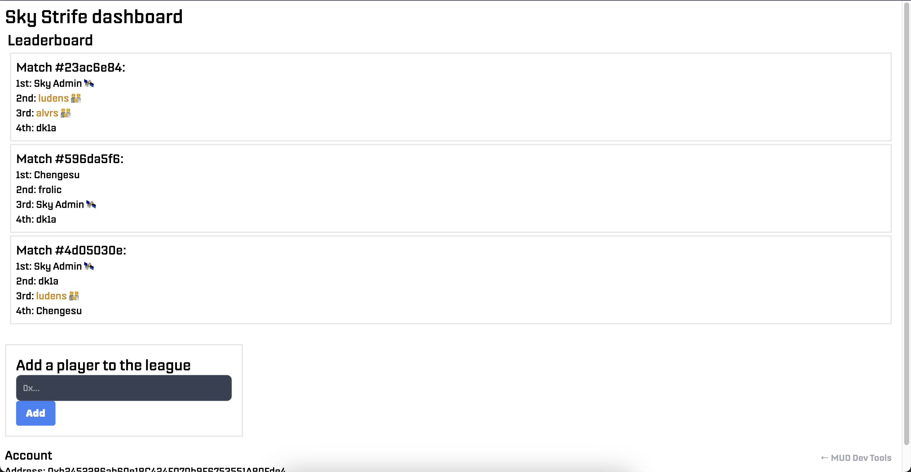

import { CollapseCode } from "../components/CollapseCode";

# 2. Creating a league

**In this section, we will accomplish the following:**

1. Extend an existing Sky Strife World by adding an `InLeague` table.
2. Add and remove players from the league with a system.
3. Interact with the new namespace on the client.

## 2.1. Create the table

To permissionlessly extend an existing World, we will use our own namespace. We can specify our projects namespace and define the tables in `mud.config.ts` in the `contracts` folder.

We start by defining the address → boolean table `InLeague`.

<CollapseCode>

```tsx filename="mud.config.ts" {4, 6-9} copy showLineNumbers
import { mudConfig } from "@latticexyz/world/register";

export default mudConfig({
  namespace: "MY_LEAGUE",
  tables: {
    InLeague: {
      keySchema: { account: "address" },
      valueSchema: { inLeague: "bool" },
    },
  },
});
```

</CollapseCode>

## 2.2. Create the system and its methods

To add players to the league, we define an `addLeagueMember` function on ` LeagueManagementSystem.sol` in `src/systems` which sets `InLeague` for the given address.

<CollapseCode>

```solidity filename="LeagueManagementSystem.sol" {5, 8-10} copy showLineNumbers
// SPDX-License-Identifier: MIT
pragma solidity >=0.8.0;

import { System } from "@latticexyz/world/src/System.sol";
import { InLeague } from "../codegen/index.sol";

contract LeagueManagementSystem is System {
  function addLeagueMember(address account) public {
    InLeague.set(account, true);
  }
}
```

</CollapseCode>

That's all we need to create a simple league app. Run the following commands to register the table and system on the testnet World.

```bash copy
cd packages/contracts
pnpm run deploy:redstone-holesky
```

## 2.3. Interact with the namespace on the client

Now that the table and system are deployed, let's create a form on the client to add players to the league.

<CollapseCode>

```tsx filename="League.tsx" {1-4, 7-37} copy showLineNumbers
import { useState } from "react";
import { PromiseButton } from "./PromiseButton";
import { Hex } from "viem";
import { useMUD } from "./MUDContext";

export function League() {
  const {
    network: { worldContract },
  } = useMUD();

  const [address, setAddress] = useState("");

  return (
    <div className="w-96 p-4 mt-8 border-2">
      <div className="text-2xl">Add a player to the league</div>

      <form onSubmit={(e) => e.preventDefault()}>
        <input
          className="bg-gray-50 border border-gray-300 text-gray-900 text-sm rounded-lg focus:ring-blue-500 focus:border-blue-500 block w-full p-2.5 dark:bg-gray-700 dark:border-gray-600 dark:placeholder-gray-400 dark:text-white dark:focus:ring-blue-500 dark:focus:border-blue-500"
          value={address}
          onChange={(event) => setAddress(event.target.value)}
          type="text"
          placeholder="0x..."
        />
        <PromiseButton
          promise={() =>
            worldContract.write.MY_NAMESPACE_LeagueManagement_addLeagueMember([
              address as Hex,
            ])
          }
        >
          Add
        </PromiseButton>
      </form>
    </div>
  );
}
```

</CollapseCode>

Finally, we can modify `Player.tsx` to color and display an emoji next to accounts that are in the league.

<CollapseCode>

```tsx filename="Player.tsx" {16-18, 23, 33} copy showLineNumbers
import { toEthAddress } from "@latticexyz/utils";
import { Hex } from "viem";
import { useMUD } from "./MUDContext";
import { useState } from "react";

export function Player({ entity }: { entity: Hex }) {
  const {
    network: { tables, useStore },
  } = useMUD();

  const [hover, setHover] = useState(false);

  const name = useStore((state) =>
    state.getValue(tables.Name, { key: entity })
  );
  const inLeague = useStore((state) =>
    state.getValue(tables.InLeague, { account: toEthAddress(entity) as Hex })
  );

  return (
    <span
      className={`w-full ${
        inLeague && inLeague.isMember ? "text-yellow-600" : null
      }`}
      onMouseEnter={() => setHover(true)}
      onMouseLeave={() => setHover(false)}
    >
      {hover ? (
        <span>{toEthAddress(entity)}</span>
      ) : (
        <span>{name ? name.value : toEthAddress(entity)}</span>
      )}{" "}
      {inLeague && inLeague.isMember ? "👪" : null}
    </span>
  );
}
```

</CollapseCode>

We have a league system! The dashboard should now look something like this:



We've built a client and extended the World - let's read the contracts on-chain.